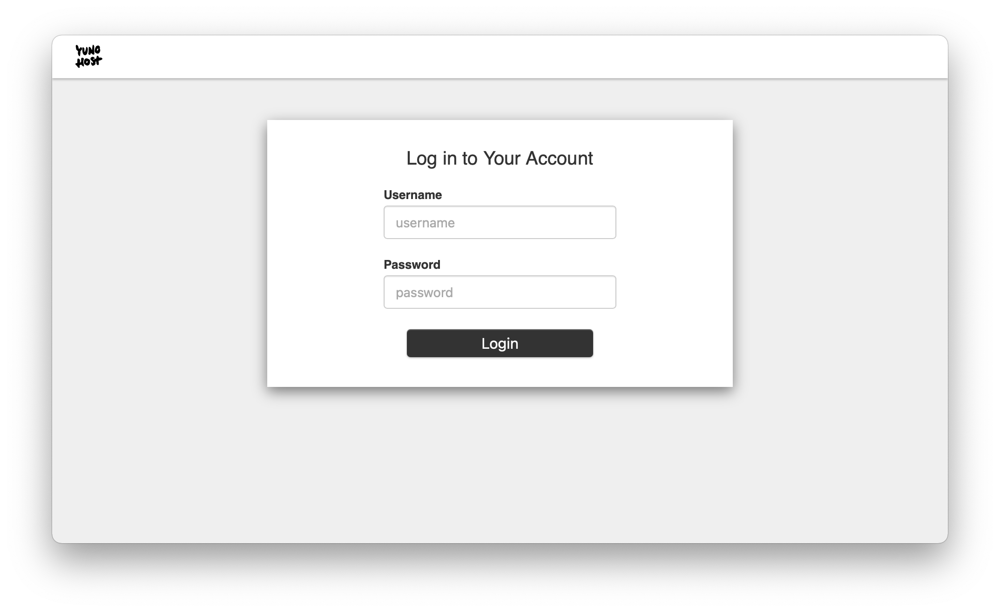

<!--
N.B.: This README was automatically generated by <https://github.com/YunoHost/apps/tree/master/tools/readme_generator>
It shall NOT be edited by hand.
-->

# Dex for YunoHost

[](https://ci-apps.yunohost.org/ci/apps/dex/)  

[](https://install-app.yunohost.org/?app=dex)

*[Read this README in other languages.](./ALL_README.md)*

> *This package allows you to install Dex quickly and simply on a YunoHost server.*  
> *If you don't have YunoHost, please consult [the guide](https://yunohost.org/install) to learn how to install it.*

## Overview

Dex is an identity service that uses OpenID Connect to drive authentication for other apps.
This YunoHost package will install Dex and setup a canonical OpenID Connect provider for your YunoHost instance, based on the LDAP user base, that can then be used as an authentification server for other YunoHost apps.

### Features

- Fully working OpenID Connect authentification flow
- Interfaced with YunoHost's LDAP server


**Shipped version:** 2.41.1~ynh2

## Screenshots



## Documentation and resources

- Official app website: <https://dexidp.io>
- Official admin documentation: <https://dexidp.io/docs/>
- Upstream app code repository: <https://github.com/dexidp/dex>
- YunoHost Store: <https://apps.yunohost.org/app/dex>
- Report a bug: <https://github.com/YunoHost-Apps/dex_ynh/issues>

## Developer info

Please send your pull request to the [`testing` branch](https://github.com/YunoHost-Apps/dex_ynh/tree/testing).

To try the `testing` branch, please proceed like that:

```bash
sudo yunohost app install https://github.com/YunoHost-Apps/dex_ynh/tree/testing --debug
or
sudo yunohost app upgrade dex -u https://github.com/YunoHost-Apps/dex_ynh/tree/testing --debug
```

**More info regarding app packaging:** <https://yunohost.org/packaging_apps>
